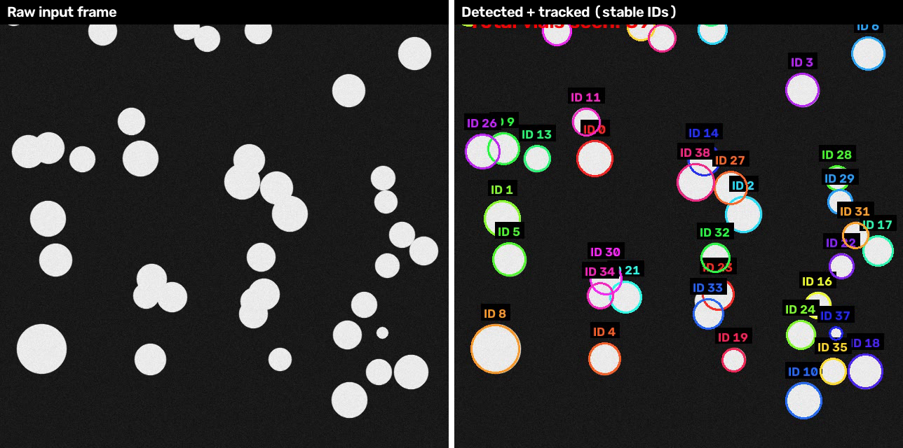
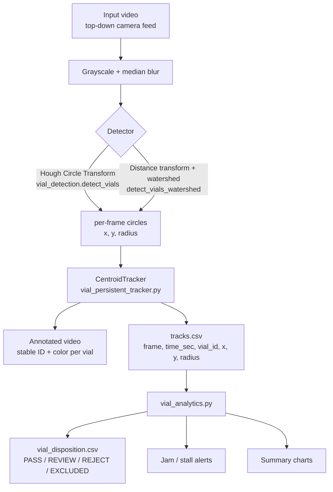
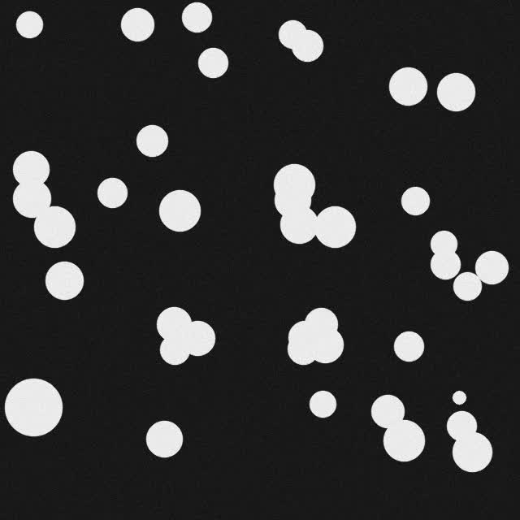

# Vial Tracking on Industrial Accumulator Table

A computer-vision pipeline that detects, tracks, and quality-triages glass
vials moving across an industrial accumulator table conveyor, using classical
OpenCV techniques end to end: detection, multi-object tracking, and
post-tracking analytics.



## Table of contents

- [Background](#background)
- [Results at a glance](#results-at-a-glance)
- [What's in this repo](#whats-in-this-repo)
- [Pipeline architecture](#pipeline-architecture)
- [Installation](#installation)
- [Quickstart with synthetic sample data](#quickstart-with-synthetic-sample-data)
- [Using your own camera footage](#using-your-own-camera-footage)
- [Detection algorithm comparison](#detection-algorithm-comparison-how-do-you-find-a-vial-in-a-frame)
- [Tracking algorithm comparison](#tracking-algorithm-comparison-how-do-you-keep-an-id-on-a-vial)
- [Post-tracking analytics](#post-tracking-analytics-from-a-csv-to-a-disposition-decision)
- [Testing & CI](#testing--ci)
- [Industrial applications](#industrial-applications)
- [Camera & lighting hardware for this application](#camera--lighting-hardware-for-this-application)
- [Known limitations & future work](#known-limitations--future-work)
- [Repository structure](#repository-structure)
- [License](#license)

## Background

Accumulator tables are a common buffer stage on packaging and filling lines:
vials, bottles, or ampoules collect on a slowly moving table between an
upstream filling/stoppering machine and a downstream
capping/labeling/inspection station. A vision system watching that buffer can
do three useful things without touching the mechanical line at all:

1. **Count throughput** — how many vials passed, and how fast.
2. **Flag a stall or jam** before it backs up (or crashes) the upstream
   machine.
3. **Triage obviously anomalous vials** — before they reach a certified
   downstream inspection station.

This repo implements that pipeline end to end: detect each vial in a
top-down camera frame, track every vial with a stable identity across
frames, and turn the resulting per-vial trajectories into throughput, jam,
and quality-triage signals a line operator can actually act on.

## Results at a glance

Every image on this page is generated directly by the code in this repo,
running against the included synthetic sample video (see
[Quickstart](#quickstart-with-synthetic-sample-data)) — nothing here is a
mockup. The before/after detection + tracking comparison is at the very
top of this page; here's what the analytics stage produces from that same
run.

**Post-tracking quality-triage disposition and rim-radius distribution**,
produced by `vial_analytics.py` from the tracker's CSV output:

<p>
  
  
</p>

## What's in this repo

| File | Purpose |
|---|---|
| [`vial_detection.py`](vial_detection.py) | Per-frame vial **detection** (Hough Circle Transform). Fast, dependency-free, no training data. |
| [`vial_persistent_tracker.py`](vial_persistent_tracker.py) | Real multi-object **tracking**: a centroid tracker that keeps a stable ID and a stable color on each vial across frames, plus an alternative watershed-based detector for dense/touching clusters, and a CSV of every observation. |
| [`vial_analytics.py`](vial_analytics.py) | Post-processing on that CSV: throughput counts, jam/stall alerts, and a PASS / REVIEW / REJECT quality-triage disposition per vial, plus summary charts. |
| [`generate_sample_video.py`](generate_sample_video.py) | Synthesizes a short sample accumulator-table video so the whole pipeline can be run and demonstrated end to end without a real camera. |
| [`tests/`](tests) | Unit tests for the tracker and the analytics logic. |
| [`.github/workflows/ci.yml`](.github/workflows/ci.yml) | CI: runs the unit tests and a full pipeline smoke test on every push. |
| `docs/images/` | Reference screenshots used in this README, generated by running the pipeline in this repo. |

## Pipeline architecture



## Installation

```bash
git clone https://github.com/manuelbomi/Vial-Tracking-on-Industrial-Accumulator-Table.git
cd Vial-Tracking-on-Industrial-Accumulator-Table
python -m venv .venv
source .venv/bin/activate   # Windows: .venv\Scripts\activate
pip install -r requirements.txt
```

Tested on Python 3.10–3.12 with `opencv-python`, `numpy`, `scipy`, `pandas`,
and `matplotlib` at the versions pinned in [`requirements.txt`](requirements.txt).

## Quickstart with synthetic sample data

The repo ships a synthetic video generator so you can run the entire
pipeline immediately, with no camera or external video file required. The
generated clip mimics a real backlit accumulator table — including a
touching/overlapping vial cluster, a stuck vial, and a couple of
deliberately mis-sized vials — so every stage of the pipeline (including the
watershed detector and every analytics disposition category) has something
real to do.

**1. Generate a sample video:**

```bash
python generate_sample_video.py sample_vials.avi
```

A single raw frame from that generated clip looks like this — bright,
backlit vial silhouettes on a dark background, matching the illumination
style described in [Camera & lighting hardware](#camera--lighting-hardware-for-this-application):



**2. Run detection only (no persistent identity, one detector pass per frame):**

```bash
python vial_detection.py sample_vials.avi detected.avi
```

**3. Run real persistent tracking (recommended for any actual use):**

```bash
python vial_persistent_tracker.py sample_vials.avi persistent_tracked.avi
# or, for heavily touching/overlapping vials:
python vial_persistent_tracker.py sample_vials.avi persistent_tracked.avi --watershed
```

This writes `persistent_tracked.avi` (annotated video) and
`persistent_tracked_tracks.csv` (raw per-frame tracking data).

**4. Turn that CSV into throughput / jam / quality-triage analytics:**

```bash
python vial_analytics.py persistent_tracked_tracks.csv --out-dir analytics_output --jam-max-path-px 45
```

This writes `analytics_output/vial_disposition.csv`,
`analytics_output/disposition_breakdown.png`, and
`analytics_output/radius_distribution.png`, and prints an operator-readable
summary to the console. Running it against the sample video prints
something like:

```
Total distinct vial tracks : 39
  PASS      : 37
  REVIEW    : 2  (route to secondary/manual inspection)
  REJECT    : 0  (divert before downstream filling/labeling)
  EXCLUDED  : 0  (too few frames to trust -- detector noise)
Population rim radius       : mean=20.77px, std=3.99px
Average dwell time in frame : 4.88s

JAM ALERTS (1 vial(s) barely moved while tracked -- possible physical jam on the table)
```

(`--jam-max-path-px` is turned up from the default in this example because
the synthetic camera noise model produces a bit more per-frame jitter than a
real global-shutter camera would — see [Known limitations](#known-limitations--future-work).)

## Using your own camera footage

Point the same commands at your own video file instead of
`sample_vials.avi` — the pipeline doesn't care where the frames came from.
In practice you will want to:

1. Measure a handful of real vials in your footage (in pixels) and set
   `--min-radius`/`--max-radius` accordingly (`vial_detection.py`'s
   defaults are tuned for the synthetic sample, not your camera).
2. Re-tune `CentroidTracker`'s `max_distance` (in `vial_persistent_tracker.py`)
   to your camera's frame rate and belt speed — it should be a bit larger
   than typical frame-to-frame vial motion, but smaller than the typical
   gap between two different vials.
3. Re-tune `vial_analytics.py`'s jam and size-anomaly thresholds against
   several *minutes* of real footage — see the
   [analytics section](#post-tracking-analytics-from-a-csv-to-a-disposition-decision)
   for why a short clip isn't enough to set these safely.

## Detection algorithm comparison: how do you find a vial in a frame?

Vials seen top-down are circles, so this is fundamentally a round-object
detection problem — the same family of problem as counting coins, cells, or
bubbles. Several classical and modern techniques apply; this project
implements the first two and documents the rest for when you outgrow them.

| Method | How it works | Strengths | Weaknesses | Used here? |
|---|---|---|---|---|
| **Hough Circle Transform** (`vial_detection.py`) | Edge pixels vote for the circle centers/radii they're consistent with; peaks in the vote accumulator are reported as circles. | Simple, fast, no training data needed, works well on well-separated/isolated objects. Parameters map directly to physical vial size. | Vote strength depends on having enough visible edge arc — touching/overlapping vials (partial rim visible) are frequently missed. Sensitive to `param2` tuning; too loose = false positives on belt texture, too strict = missed vials. | **Yes**, default detector. |
| **Otsu threshold + distance transform + watershed** (`vial_persistent_tracker.py`, `--watershed`) | Binarize bright vials vs. dark background, then use the distance-to-background transform to find one seed per vial *even inside a fused blob*, and flood-fill outward from each seed until floods meet. | Specifically designed to split touching/overlapping round objects — the classic technique for the same problem in coin/cell counting. Recovers vials Hough misses in dense clusters. | Needs a foreground/background mask that separates cleanly (struggles under very uneven illumination unless you swap in adaptive thresholding). More parameters to tune (peak spacing, blur, morphology kernel). Slower per frame. | **Yes**, opt-in via `--watershed`. |
| **Contour detection + circularity filter** (`cv2.findContours` + `4*pi*area/perimeter^2` check) | Threshold, find each connected blob's outline, keep the ones whose shape is close enough to a circle. | Very simple to reason about and tune; gives you the actual blob mask (useful if you also want area/shape features, not just a circle fit). | Same touching-object weakness as Hough unless combined with watershed; circularity threshold is a blunt instrument compared to Hough's model-based voting. | No (subsumed by the watershed path, which already starts from a similar threshold step). |
| **`cv2.SimpleBlobDetector`** | Threshold at multiple levels, group stable blobs across those levels, filter by area/circularity/convexity/inertia. | Built into OpenCV, handles some brightness variation better than a single fixed threshold, easy blob-shape filtering knobs. | Tuning six-plus filter parameters is fiddly; still fundamentally a single-object-per-blob method, so touching vials remain a problem. | No. |
| **Template matching** | Slide a reference vial-rim image over the frame, score by normalized cross-correlation. | Trivial to implement; no calibration of geometric parameters needed if you have a good template. | Not rotation/scale invariant without generating many template variants; slow at high resolution; poor with partial occlusion — a bad fit for a dense, jumbled accumulator table. | No. |
| **Deep learning instance segmentation** (e.g. YOLOv8-seg, Mask R-CNN) | A CNN trained on labeled vial images directly predicts a mask/box per vial, learning what occlusion, glare, and clutter look like. | By far the most robust to touching/overlapping/partially-occluded vials, varying lighting, and even non-circular defects (a model can be trained to also flag chips/cracks directly). This is what real high-throughput inspection lines increasingly use. | Needs a labeled training set and a training/maintenance workflow; needs a GPU (or a well-optimized edge accelerator) to hit real-time frame rates; far more moving parts to deploy and validate than a parameter-tuned classical CV method. | No — the natural next step for a real deployment; see [Known limitations](#known-limitations--future-work). |

**Practical takeaway:** start with Hough (fast, zero training data, easy to
reason about). If your accumulator table runs dense enough that vials
routinely touch, add the watershed path for those regions, or budget for a
trained segmentation model if missed/merged detections are costing you
real accuracy.

## Tracking algorithm comparison: how do you keep an ID on a vial?

Detecting circles frame-by-frame is necessary but not sufficient for
"tracking" — you also need to decide which circle in frame *N+1*
corresponds to which circle in frame *N*. Here's a full-resolution frame
of `CentroidTracker`'s output — every ring's ID and color stay the same
vial to vial across the whole clip:


| Method | Idea | Strengths | Weaknesses | Used here? |
|---|---|---|---|---|
| **Centroid tracker (greedy nearest-neighbor)** | Match each existing track to the closest new detection within a distance gate; age out unmatched tracks; register unmatched detections as new tracks. | Simple, fast, no extra dependencies, easy to understand and debug. Works well when objects move slowly relative to the frame rate (true here — this table moves vials slowly). | Greedy matching isn't globally optimal — can swap identities between two vials that pass close together. No motion model, so a brief full occlusion (more frames missed than `max_disappeared`) permanently loses the ID. | **Yes**, `CentroidTracker` in `vial_persistent_tracker.py`. |
| **Hungarian-algorithm matching** (`scipy.optimize.linear_sum_assignment`) | Same idea as the centroid tracker, but solves the assignment problem exactly instead of greedily. | Globally optimal match for a given frame — removes the identity-swap failure mode of greedy matching, same distance-only cost model otherwise. | Still no motion prediction, so long occlusions still break tracks. Marginally more compute (still trivial at this scale). | No — noted as the first upgrade to make if ID swaps are observed; the swap-in point is clearly marked in `CentroidTracker.update()`. |
| **Kalman filter per track + Hungarian matching (SORT)** | Each track predicts its next position (constant-velocity model) before matching, so matching is done against *predicted* position, not last-seen position, and a track can survive a few frames of no detection while still "believing" where the object should be. | Handles brief occlusions and faster motion much better than a bare centroid tracker; industry-standard baseline for real-time MOT. | More code/state per track; still no appearance model, so it can still swap identities between two similar, closely-spaced objects if their motion is ambiguous. | No — natural next upgrade for a faster or more crowded line; see [Known limitations](#known-limitations--future-work). |
| **DeepSORT / ByteTrack (appearance + motion)** | Adds a learned appearance embedding per detection, so matching considers "does this look like the same vial" as well as "is this where I predicted it to be." | Most robust to occlusion and crowding; the standard choice for dense, fast real-world multi-object tracking (retail, traffic, sports analytics). | Needs a feature-extraction model (more compute, another dependency), and identical glass vials give a much weaker appearance signal than, say, distinct people or vehicles — the benefit over motion-only SORT is smaller for this specific object type. | No — likely overkill for this object type/line speed; listed for completeness. |

**Practical takeaway:** a plain centroid tracker is a reasonable, honest
baseline for a slow accumulator table, which is why it's what's implemented
here — but it is *not* the last word for a faster or denser line. The
upgrade path (Hungarian matching, then a Kalman filter/SORT) is
incremental, is called out directly in the `CentroidTracker` docstring, and
doesn't require throwing away the detector or the CSV schema.

## Post-tracking analytics: from a CSV to a disposition decision

`vial_persistent_tracker.py` writes one row per `(frame, vial)` observation:

```
frame,time_sec,vial_id,x,y,radius
0,0.0,0,547,191,27
0,0.0,1,511,401,29
...
```

`vial_analytics.py` turns that raw telemetry into three things a line
operator actually acts on:

**1. Throughput.** Group by `vial_id` to get a total distinct-vial count and
per-vial dwell time in frame — the basic "how many vials, how fast" metric.

**2. Jam / stall alerts (a process signal, not a quality signal).** A vial
whose total *path length* (sum of frame-to-frame movement, not net
start-to-end displacement — see the docstring for why that distinction
matters) stays near zero over many consecutive frames is very likely
physically stuck. This is reported separately from product-quality
disposition below, because a jam is a line-mechanics problem, not a defect
in the vial itself. The output includes the jammed vial's last known
`(x, y)`, so an operator knows where to look.

**3. Quality disposition (PASS / REVIEW / REJECT).** Using only the
geometry the tracker measured — a vial's own rim radius consistency across
its track, and how its average radius compares to the rest of the batch —
each vial is classified as:

- **PASS** — nothing geometrically unusual.
- **REVIEW** — one anomaly flag tripped (unusual size vs. the batch, an
  unstable/wobbly radius reading across its own track, or a high rate of
  "invisible for a frame then re-detected"). Route to secondary/manual
  inspection.
- **REJECT** — *two* independent anomaly flags agree (unusual size **and**
  an unstable rim). Divert before the vial reaches downstream
  filling/labeling.
- **EXCLUDED** — track too short to trust (almost certainly a detector
  blip, not a real vial); not counted as a quality judgment either way.

See the charts in [Results at a glance](#results-at-a-glance) above for
what this looks like on the included sample video.

> **On what "quality disposition" does and doesn't mean here:** this
> pipeline sees one thing — a circle's position and radius from a single
> top-down camera. That genuinely can hint at a chipped/broken rim
> (SIZE_ANOMALY, UNSTABLE_RIM) or a wrong-SKU vial mixed into the batch, but
> it **cannot** see cracks that don't change the outer silhouette, cloudy or
> discolored glass, foreign particulate in the fill, fill-level, or
> stopper/cap seating — those need dedicated imaging (raking/dark-field
> light for surface defects, particulate-tuned backlighting, a fill-level
> line-scan camera) and typically a trained defect classifier, not raw
> circle geometry. **Treat this disposition as a triage signal** — "worth a
> second look" vs. "nothing geometrically unusual" — not a certified
> pass/fail, especially in a regulated environment like pharmaceutical vial
> filling.

**Extending this to real defect detection.** The CSV already has everything
needed to plug in genuine defect features: for every `(frame, vial_id, x, y,
radius)` row, crop that region out of the corresponding source frame, run
the crop through a trained defect classifier (chip/crack/discoloration/etc.
— e.g. a small CNN fine-tuned on a labeled defect dataset), and merge the
resulting `defect_score` column into `classify_vials()` in
`vial_analytics.py` alongside the existing geometric flags. The
PASS/REVIEW/REJECT routing logic doesn't need to change — only the signals
feeding it.

## Testing & CI

```bash
pytest
```

`tests/test_tracker.py` covers `CentroidTracker`'s ID assignment,
persistence across small movement, retirement after `max_disappeared`, and
its distance gate. `tests/test_analytics.py` covers per-vial aggregation
(path length, dwell time) and the PASS/REVIEW/REJECT/EXCLUDED classification
logic on constructed CSV data.

[`.github/workflows/ci.yml`](.github/workflows/ci.yml) runs that suite on
Python 3.10–3.12 on every push and pull request, then runs the full
pipeline (sample-video generation → tracking → analytics) as an end-to-end
smoke test, so a regression that only shows up when the stages are wired
together gets caught too.

## Industrial applications

Round-object detection + tracking + count/triage on a conveyor or
accumulator table is a common building block well beyond this one clip:

- **Pharmaceutical vial/ampoule filling lines.** Accumulator tables are a
  standard buffer stage between filling/stoppering and downstream
  capping/inspection/labeling machines. Vision at this stage is used for
  throughput counting, jam detection (a stalled accumulator table can back
  up or crash an upstream filler), and early triage before a vial reaches a
  certified visual-inspection station. This is a validated-process,
  regulated environment (cGMP, 21 CFR Part 211) where visible-particulate
  and container/closure integrity inspection follow standards like USP
  &lt;790&gt;/&lt;1790&gt; — worth knowing as context for why this repo is
  explicit that its disposition logic is a triage aid, not a certified
  inspection system.
- **Beverage / cosmetics / food bottling and jarring lines.** The same
  top-down, backlit, round-container counting problem applies directly to
  bottles, jars, and cans on accumulation tables and turntables.
- **Discrete-parts counting on general conveyors.** Any process that needs
  "how many parts passed" or "is anything stuck" — including non-round
  parts, once you swap the detector for one suited to that shape — reuses
  the same detect → track → analyze skeleton in this repo.
- **Semiconductor wafer/die and small-parts counting.** Structurally the
  same problem (many small, roughly uniform round/rectangular objects,
  need an accurate count and outlier flags) at a different physical scale.
- **Line monitoring / OEE (Overall Equipment Effectiveness) integration.**
  The throughput and jam-alert outputs here are exactly the kind of signal
  that feeds an OEE dashboard or a SCADA/MES alarm — see the
  connectivity notes in the next section.

## Camera & lighting hardware for this application

A real deployment of this kind of system should be monochrome,
high-contrast, and **backlit** (vial rims read as bright rings against a
darker, evenly-lit background — that's precisely the illumination style
that makes Hough Circle Transform and Otsu thresholding work well with
minimal tuning, and what `generate_sample_video.py` models). If you're
specifying camera hardware for a real deployment, here's what matters and
why:

### Interface / bus standard

| Standard | Typical use | Notes |
|---|---|---|
| **GigE Vision** | Most common choice for fixed inspection stations. | Cable runs up to ~100m without a repeater, standard Ethernet infrastructure, easy to integrate with PLC networks; bandwidth (~1 Gbps, or 5/10 GigE variants for higher throughput) can bottleneck very high frame-rate/resolution setups. |
| **USB3 Vision** | Compact setups, shorter cable runs (~a few meters without an active extender). | Very high bandwidth, low latency, lower cost, but less common in a cabinet-to-camera-far-away layout on a large machine. |
| **CoaXPress** | High-speed / high-resolution line-scan or very fast area-scan applications. | Long cable runs at very high bandwidth over coax; higher cost, more specialized frame-grabber hardware. |

A 1080p-class monochrome area-scan camera at 10-30 fps comfortably fits well
within GigE or USB3 bandwidth — no need for CoaXPress at this scale unless
line speed increases substantially.

### Shutter type: global, not rolling

**Global shutter is a hard requirement**, not a nice-to-have, for vials
moving on a conveyor: a rolling shutter exposes each row of the sensor at a
slightly different instant, which skews/smears a moving round rim into an
egg shape and directly corrupts the radius measurements this whole pipeline
depends on. Any industrial camera marketed for machine vision defaults to
global shutter; just make sure a candidate sensor is explicitly specified
as such.

### Monochrome vs. color

**Monochrome is the right choice here.** A monochrome sensor has no Bayer
color filter array, so it has higher effective spatial resolution and
better light sensitivity per pixel than a color sensor of the same physical
resolution — and color information isn't useful for detecting a clear-glass
rim's silhouette against a backlight anyway. Reserve color for a downstream
station that specifically needs to judge liquid color/clarity or a printed
label.

### Lens: consider a telecentric lens

A standard fixed-focal-length lens has perspective error: an object's
apparent size and center position shift slightly depending on its exact
height and its position relative to the lens's optical axis. For a system
whose whole output is "this vial's radius," that error directly becomes
noise in the SIZE_ANOMALY signal in `vial_analytics.py`. A **telecentric
lens** (common in machine vision metrology) keeps magnification constant
regardless of object distance/position within its working range, which is
exactly what you want when the measured quantity *is* the size. It costs
more and has a fixed working distance/field of view, so it's a
deliberate trade — recommended if disposition decisions in
production actually hinge on precise size measurement; a standard lens is
fine if the vision system is mainly doing presence/position/counting.

### Illumination

| Style | What it's good for | Relevant here? |
|---|---|---|
| **Backlighting** (light source behind/below the object, camera looking through it) | Crisp, high-contrast silhouettes — exactly what this pipeline is designed around, and what makes simple thresholding/Hough work well. | Yes — matches the pipeline's assumptions. |
| **Diffuse dome / ring lighting** (even illumination from many angles) | Reduces glare/hot-spots on curved glass; better for seeing surface features (labels, fill level) than a pure silhouette. | Complementary — useful if you add a defect-detection station downstream. |
| **Coaxial / dark-field lighting** | Makes surface defects (scratches, chips) stand out via how they scatter light differently than an intact surface. | Needed if you extend to real optical defect detection (see the analytics section above). |
| **Polarized lighting/filters** | Cuts specular glare/reflections off curved glass, which otherwise show up as spurious bright spots a naive detector can mistake for edges. | Worth adding if glare is causing false detections. |
| **Strobed/pulsed illumination synced to camera exposure** | Freezes motion with a very short effective exposure without needing a very fast (noisy) shutter speed. | Worth it if line speed increases and standard exposure starts showing motion blur. |

### Example industrial camera families (for specification purposes)

- **Basler ace2 / boost** (GigE / USB3, global shutter monochrome variants)
- **Teledyne FLIR Blackfly S** (GigE / USB3)
- **Teledyne Dalsa Genie Nano**
- **Keyence CV-X / XG series** (very common in pharma/vial visual-inspection
  systems specifically; typically sold as a full smart-camera + lighting +
  software package)
- **Cognex In-Sight** (smart camera — onboard processing, good fit if you
  want detection logic to live on the camera itself rather than a separate
  PC)
- **IDS uEye / Allied Vision Alvium** (compact, cost-effective options for
  smaller integrations)

**Smart camera vs. PC + frame grabber:** a smart camera (Cognex In-Sight,
Keyence CV-X) runs detection logic on the camera itself and outputs
results/alarms directly, which simplifies integration but limits you to
that vendor's software environment. A standard industrial camera feeding an
industrial PC (or an edge device like an **NVIDIA Jetson** for on-site GPU
inference) gives you the flexibility this repo assumes — full Python/OpenCV
control, easy to extend with a custom trained model later — at the cost of
managing that PC/edge box yourself.

### Environment & integration

- **IP67 / washdown-rated housings** if the camera is anywhere near a
  cleanroom washdown or wet-clean process, common in pharma/food/beverage
  filling areas.
- **Hardware trigger from the line's PLC** (rather than free-running or
  software-triggered capture) minimizes frame-to-frame timing jitter,
  which matters once you're measuring motion (path length, dwell time) as
  precisely as this project's analytics does.
- **OPC-UA or MQTT** as the integration layer to push throughput counts,
  jam alerts, and disposition summaries from `vial_analytics.py` into a
  plant's MES/SCADA/OEE system, rather than treating this as a standalone
  offline tool.

## Known limitations & future work

- **Detection:** Hough Circle Transform misses vials in dense, heavily
  touching clusters; the watershed alternative recovers more of them but
  needs illumination tuning of its own. A trained segmentation model is the
  most robust fix, at the cost of needing labeled training data.
- **Tracking:** `CentroidTracker` uses greedy nearest-neighbor matching
  with no motion model, so it can swap IDs between close, similarly-moving
  vials and permanently loses a track after `max_disappeared` consecutive
  missed frames (no recovery from a longer occlusion). See the
  [tracking comparison](#tracking-algorithm-comparison-how-do-you-keep-an-id-on-a-vial)
  table for the concrete upgrade path (Hungarian matching, then a Kalman
  filter/SORT).
- **Analytics/disposition:** built entirely from tracked circle geometry —
  it is a triage signal, not a certified defect-inspection system. See the
  "what quality disposition does and doesn't mean" callout above and the
  extension path to a real trained defect classifier.
- **Jam-alert and size-anomaly thresholds** should be tuned against several
  *minutes* of real footage from your own camera/line before being trusted
  operationally — the defaults are reasonable starting points, not
  universal constants. This matters especially for `--jam-max-path-px`,
  since the right value depends on your camera's own positional noise
  floor (see the note in the [Quickstart](#quickstart-with-synthetic-sample-data)).
- **Camera assumptions:** the whole pipeline assumes a fixed, top-down,
  backlit, global-shutter monochrome camera. A different camera geometry
  or lighting style will need re-tuned (or different) detection parameters.
- **Sample data:** `generate_sample_video.py` produces synthetic footage
  for demonstration and testing purposes, not a substitute for validating
  against real camera footage before any production use.

## Repository structure

```
.
├── vial_detection.py              # Hough-based per-frame detection
├── vial_persistent_tracker.py     # Real multi-object tracking + CSV export
├── vial_analytics.py              # CSV -> throughput / jam alerts / quality disposition + charts
├── generate_sample_video.py       # Synthetic sample-video generator for a runnable end-to-end demo
├── requirements.txt
├── tests/
│   ├── test_tracker.py
│   └── test_analytics.py
├── .github/workflows/ci.yml       # Unit tests + full-pipeline smoke test on every push
└── docs/
    └── images/                    # Screenshots used in this README
```

Running the scripts (see [Quickstart](#quickstart-with-synthetic-sample-data))
will also produce, alongside the sample video: `detected.avi`,
`persistent_tracked.avi` (+ its `_tracks.csv`), and an `analytics_output/`
directory. These generated files are gitignored — see `.gitignore`.

## License

MIT — see [LICENSE](LICENSE).

---

### **AUTHOR'S BACKGROUND**
### Author's Name:  Emmanuel Oyekanlu
```
Skillset:   I have experience spanning several years in data science, enterprise AI architecture and solutions, developing scalable enterprise data pipelines,
enterprise solution architecture, architecting enterprise systems data and AI applications,
software and AI solution design and deployments, data engineering, industrial intelligent vision systems, high performance computing (GPU, CUDA), machine learning,
NLP, Agentic-AI and LLM applications as well as deploying scalable solutions (apps) on-prem and in the cloud.

I can be reached through: manuelbomi@yahoo.com

Publications:  https://scholar.google.com/citations?user=S-jTMfkAAAAJ&hl=en
LinkedIn:  https://www.linkedin.com/in/emmanuel-oyekanlu-6ba98616
Github:  https://github.com/manuelbomi

```
[](https://skillicons.dev)
